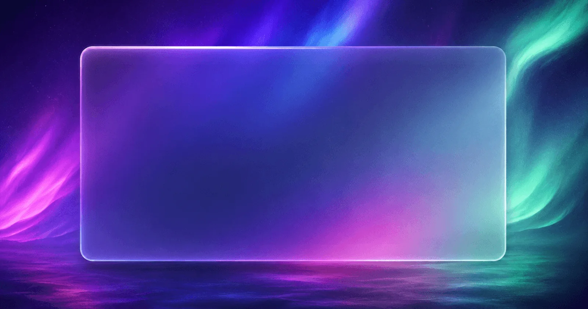

<div align="center">

# astro-haze

### A glassmorphism **Astro 7** theme for publishing, portfolios & polished product launches

[](https://github.com/kpab/astro-haze/actions/workflows/deploy.yml)
[](https://astro.build)
[](https://www.typescriptlang.org)
[](https://nodejs.org)
[](LICENSE)

**[Live demo](https://kpab.github.io/astro-haze/)** · [Features](#features) · [Quick start](#quick-start) · [Configuration](#site-configuration) · [Content](#adding-content) · [Deploy](#deploy-to-github-pages)



</div>

> `astro-haze` is a static, content-first theme with a reusable glass UI system. It ships
> with a paginated blog, portfolio case studies, and an e-commerce landing page — plus the
> SEO, feeds, responsive behavior, and accessibility details needed to turn the starter into
> a real site.

---

## Features

| | |
| --- | --- |
| **Glass UI system** | Aurora backgrounds with reusable cards, buttons, badges, tags, sections & containers |
| **Light / dark** | System-aware theme toggle with no-flash startup and synced `theme-color` |
| **Blog** | Pagination, tags, table of contents, reading time, share links, prev/next navigation |
| **Portfolio** | Index with technology filters, case-study pages, and responsive galleries |
| **Landing page** | Config-driven hero, features, benefits, pricing, gallery, testimonials, FAQ & final CTA |
| **Content Layer** | Astro 7 collections with Zod-validated frontmatter; Markdown **and** MDX (Sätteri engine) |
| **SEO & feeds** | Canonical URLs, Open Graph, Twitter cards, JSON-LD, RSS feed & XML sitemap |
| **Accessible** | Landmarks, skip nav, keyboard focus states, WCAG AA-conscious color & interaction |
| **Respectful motion** | Honors `prefers-reduced-motion` and `prefers-reduced-transparency` |
| **Optimized images** | AVIF/WebP with responsive `srcset` via `astro:assets` |
| **Static & fast** | Minimal client JS — deploys to GitHub Pages or Cloudflare Pages |

> [!NOTE]
> Blog hero images and project covers/galleries are validated with Astro's `image()` helper
> and optimized to AVIF/WebP with a responsive `srcset`. Store them under `src/assets/` and
> reference them with a path relative to the Markdown file
> (e.g. `../../assets/images/blog/atmosphere.webp`). Remote URLs and `public/` string paths
> (e.g. the landing demo) are rendered unchanged.

---

## Screenshots

| Light | Dark |
| --- | --- |
|  |  |
|  |  |

---

## Quick start

> **Requirements:** Node.js 22.12 or newer · npm

```sh
npm install
npm run dev
```

Open the local URL printed by Astro. Astro 7 can detect an AI-agent environment and run the
dev server in the background — inspect it with:

```sh
npx astro dev status
npx astro dev logs
```

Create a production build (written to `dist/`):

```sh
npm run build
```

| Command | Purpose |
| --- | --- |
| `npm run dev` | Start the Astro development server |
| `npm run build` | Build the production site |
| `npm run preview` | Preview the production build locally |
| `npm run check` | Run Astro diagnostics and TypeScript without emitting files |

---

## Project structure

```text
src/
├── components/
│   ├── blog/        # Blog cards, pagination, post grid, and table of contents
│   ├── common/      # Header, footer, SEO, theme toggle, and aurora background
│   ├── landing/     # Config-driven landing-page sections
│   ├── portfolio/   # Project cards and galleries
│   └── ui/          # Shared GlassCard, Button, Picture, Tag, and layout primitives
├── content/
│   ├── blog/        # Markdown and MDX posts
│   ├── landing/     # JSON or YAML landing-page data
│   └── projects/    # Markdown and MDX portfolio case studies
├── layouts/         # Base document layout
├── lib/             # Shared content + URL helpers
├── pages/
│   ├── blog/        # Blog index, pagination, and article routes
│   ├── landing/     # E-commerce landing route
│   ├── tags/        # Tag index and archive routes
│   ├── work/        # Portfolio index and project routes
│   └── rss.xml.ts   # RSS endpoint
├── styles/          # Design tokens, glass effects, and global styles
├── content.config.ts
└── site.config.ts
```

---

## Site configuration

Edit [`src/site.config.ts`](src/site.config.ts) for site identity, navigation, feature
visibility, social links, and page options.

### Identity and theme

| Field | Type | Purpose |
| --- | --- | --- |
| `name` | `string` | Short site or brand name used in the header and footer |
| `title` | `string` | Default full site title |
| `description` | `string` | Default site description and footer copy |
| `author` | `string` | Default author identity |
| `url` | `string` | Canonical production origin |
| `ogImage` | `string` | Default Open Graph image path |
| `twitterHandle` | `string` | Site or author handle for social metadata |
| `theme.accentColor` | `string` | Accent value; keep it synchronized with the CSS accent tokens described below |
| `theme.defaultColorMode` | `'light' \| 'dark' \| 'system'` | Initial color mode when the visitor has no saved preference. `light`/`dark` apply that mode at startup (no flash); `system` follows the OS. Honored by both the inline startup script and the theme toggle |
| `theme.showThemeToggle` | `boolean` | Renders the floating theme toggle when `true` |

### Navigation and feature flags

| Field | Type | Purpose |
| --- | --- | --- |
| `nav.main` | `Array<{ name: string; href: string }>` | Main navigation entries used by the header and footer |
| `features.blog` | `boolean` | Shows or hides the blog entry in the main header |
| `features.portfolio` | `boolean` | Shows or hides the portfolio entry in the main header |
| `features.landing` | `boolean` | Shows or hides the landing-page entry in the main header |
| `features.rss` | `boolean` | Controls the RSS discovery `<link>`; the `/rss.xml` feed is always generated |
| `features.sitemap` | `boolean` | Enables the `@astrojs/sitemap` integration in `astro.config.mjs` |

Header navigation entries and the sitemap integration respond to these flags. The `/rss.xml`
feed and content routes are always part of the static build.

### Social links

All social fields are optional strings.

| Field | Used for |
| --- | --- |
| `social.github` | GitHub link in the footer |
| `social.twitter` | Twitter/X link in the footer |
| `social.linkedin` | LinkedIn link in the footer |
| `social.instagram` | Instagram link in the footer |
| `social.youtube` | YouTube link in the footer |

### Blog options

| Field | Type | Purpose |
| --- | --- | --- |
| `blog.postsPerPage` | `number` | Number of posts on each blog archive page |
| `blog.showToc` | `boolean` | Shows the generated table of contents when headings exist |
| `blog.showReadingTime` | `boolean` | Shows estimated reading time |
| `blog.showShareButtons` | `boolean` | Shows article share links |
| `blog.showRelatedPosts` | `boolean` | Shows previous/next article navigation |

### Portfolio options

| Field | Type | Purpose |
| --- | --- | --- |
| `portfolio.projectsPerPage` | `number` | Projects per page on the work archive (`/work`, then `/work/page/N`) |
| `portfolio.showTechStack` | `boolean` | Shows the technology stack on project cards and project pages |
| `portfolio.showYear` | `boolean` | Shows the project year on project cards and project pages |

---

## Adding content

Collection definitions and validation rules live in
[`src/content.config.ts`](src/content.config.ts). Astro reports invalid or missing fields
during development and builds.

### Blog posts

Add `.md` or `.mdx` files to `src/content/blog/`:

```md
---
title: "Designing with atmosphere"
description: "How to keep glass interfaces readable and useful."
pubDate: 2026-06-28
updatedDate: 2026-07-02
heroImage: "../../assets/images/blog/atmosphere.webp"
heroImageAlt: "Layered translucent interface panels"
tags:
  - design
  - astro
author: "Your Name"
draft: false
featured: true
---

Write the article here.
```

| Field | Requirement |
| --- | --- |
| `title` | Required string |
| `description` | Required string |
| `pubDate` | Required date-coercible value |
| `updatedDate` | Optional date-coercible value |
| `heroImage` | Optional local image under `src/assets/` (relative path), optimized via `astro:assets` |
| `heroImageAlt` | Optional string |
| `tags` | String array; defaults to `[]` |
| `author` | String; defaults to `Anonymous` |
| `draft` | Boolean; defaults to `false` |
| `featured` | Boolean; defaults to `false` |

### Portfolio projects

Add `.md` or `.mdx` files to `src/content/projects/`:

```md
---
title: "Northstar"
summary: "A clear route through complex public services."
description: "An optional longer summary for metadata and the case-study lead."
cover: "../../assets/images/projects/northstar-cover.webp"
coverAlt: "Northstar shown on desktop and mobile"
images:
  - "../../assets/images/projects/northstar-search.webp"
  - "../../assets/images/projects/northstar-mobile.webp"
tech:
  - Astro
  - TypeScript
role: "Design engineering"
year: 2026
featured: true
links:
  live: "https://example.com"
  github: "https://github.com/example/northstar"
  case: "/contact"
client: "Northstar Council"
duration: "16 weeks"
---

Write the case study here.
```

| Field | Requirement |
| --- | --- |
| `title` | Required string |
| `summary` | Required string |
| `description` | Optional string |
| `cover` | Required local image under `src/assets/` (relative path), optimized via `astro:assets` |
| `coverAlt` | Optional string |
| `images` | Optional array of local images under `src/assets/` (relative paths) |
| `tech` | Required string array |
| `role` | Required string |
| `year` | Required number |
| `featured` | Boolean; defaults to `false` |
| `links.live` | Optional valid URL |
| `links.github` | Optional valid URL |
| `links.case` | Optional string path or URL |
| `client` | Optional string |
| `duration` | Optional string |

### Landing-page data

Add `.json`, `.yaml`, or `.yml` files to `src/content/landing/`. The current landing route
loads the first entry in this collection. Only `hero` is required:

```json
{
  "hero": {
    "title": "A considered product",
    "subtitle": "Made for everyday rituals",
    "description": "A concise value proposition.",
    "cta": {
      "primary": { "text": "Shop now", "href": "#pricing" },
      "secondary": { "text": "Learn more", "href": "#features" }
    },
    "image": "/images/landing/product.webp"
  }
}
```

The complete landing schema accepts these optional sections:

| Section | Shape |
| --- | --- |
| `features` | Array of `{ title, description, icon?, image? }` |
| `benefits` | Array of `{ title, description, icon? }` |
| `pricing` | Array of `{ name, price, period?, description, features, highlighted?, cta: { text, href } }`; `highlighted` defaults to `false` |
| `gallery` | Array of `{ src, alt, caption? }` |
| `testimonials` | Array of `{ name, role, company?, content, avatar?, rating? }`; rating must be from 1 to 5 |
| `faq` | Array of `{ question, answer }` |
| `finalCta` | `{ title, description, button: { text, href } }` |

Within `hero`, `title`, `subtitle`, `description`, and `cta.primary` are required.
`cta.secondary` and `image` are optional.

---

## Customization

### Accent color

The rendered color system is controlled by CSS custom properties in
[`src/styles/tokens.css`](src/styles/tokens.css). Update `--color-accent` and its related
light, dark, and glass variants in both the light and dark token blocks. Keep
`theme.accentColor` in `src/site.config.ts` set to the same base accent so configuration
metadata and CSS remain aligned.

### Design tokens

`src/styles/tokens.css` contains color, typography, spacing, radius, transition, z-index, and
container tokens. Core glass surfaces and fallbacks live in `src/styles/glass.css`; global
element styles live in `src/styles/global.css`.

### Images

The shared [`src/components/ui/Picture.astro`](src/components/ui/Picture.astro) component
produces AVIF and WebP sources for imported local assets. Use descriptive `alt` text and
explicit responsive sizes.

---

## Deploy to GitHub Pages

This repo ships a workflow at [`.github/workflows/deploy.yml`](.github/workflows/deploy.yml)
that builds with [`withastro/action`](https://github.com/withastro/action) and publishes to
GitHub Pages on every push to `master`.

1. In the repository **Settings → Pages**, set **Source** to **GitHub Actions**.
2. Push to `master` (or run the workflow manually from the **Actions** tab).

The site is configured for a **project page** in `astro.config.mjs`:

```js
site: 'https://kpab.github.io',
base: '/astro-haze',
```

So it is served from `https://kpab.github.io/astro-haze/`. All internal links go through the
`withBase()` helper ([`src/lib/url.ts`](src/lib/url.ts)), which prefixes `base`.

To deploy under a different repo, user site, or custom domain, update `site`, `base`,
`siteConfig.url`, and the `Sitemap:` line in `public/robots.txt`. With a user site
(`<user>.github.io`) or a custom domain, set `base: '/'`.

> [!TIP]
> The `public/_headers` file is for Cloudflare Pages and is ignored by GitHub Pages; it's
> kept for users deploying there instead.

---

## License

Released under the [MIT License](LICENSE).

<div align="center">
<sub>Built with <a href="https://astro.build">Astro</a> · glassmorphism, done tastefully</sub>
</div>
